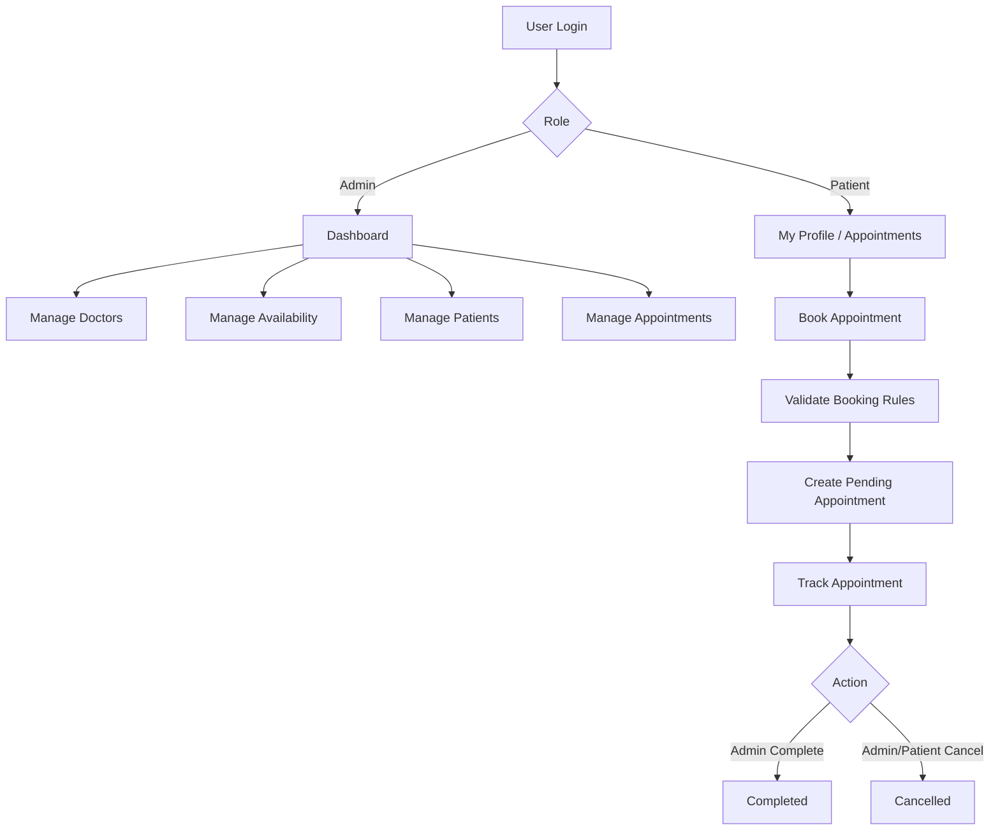
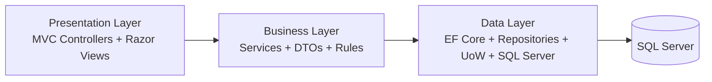

🏥 Clinic Management System
Production-style ASP.NET Core MVC platform for clinic operations, scheduling, and patient workflow management.

      

A full-stack clinic operations platform built with a layered architecture and real-world workflow rules.
The system enables clinic administrators to manage doctors, schedules, patients, and appointment lifecycles, while patients can maintain their profile and book/cancel appointments under strict business constraints.

1) Project Overview
What this platform does
A web-based clinic management platform that centralizes:

Doctor directory and working availability
Patient profiles and records
Appointment booking and lifecycle tracking
Admin dashboard analytics
Problem it solves
Manual scheduling and fragmented tracking create booking conflicts, poor visibility, and operational delays.
This platform standardizes appointment orchestration with enforceable rules and role-based access.

Who uses it
Admin staff: manage clinic operations end-to-end
Patients/users: maintain profile and self-serve appointment booking
Admin workflow (high level)
Authenticate → Monitor dashboard → Manage doctors/patients/availability → Manage appointments → Update status/delete safely.

Patient workflow (high level)
Register/Login → Complete profile → Browse doctors → Book appointment → Track/cancel pending appointments.

2) Live Demo
Replace placeholders with production values.

Item	Value
Live URL	https://<your-live-url>
Admin Login	admin@yourdomain.com / <admin-password>
Demo Patient Login	patient@yourdomain.com / <patient-password>
3) Full System Workflow
A) Admin Flow
Admin authenticates via ASP.NET Core Identity.
Home route redirects admin to Dashboard.
Admin reviews KPI cards (Doctors, Patients, Appointments, Pending).
Admin manages doctors (create/update/details/delete).
Admin configures doctor availability (day, start/end, slot duration, overlap validation).
Admin manages patients (create/update/details/delete).
Admin views all appointments.
Admin updates appointment status (Pending → Completed/Cancelled only).
Admin can soft delete appointments.
System reflects updated counts and operational state on dashboard.
B) Patient/User Flow
User registers and signs in.
System links user account to patient profile.
User can review/update My Profile.
User opens booking form and browses doctors.
User submits appointment request.
System validates booking constraints.
Appointment is stored as Pending.
User views only their own appointments.
User can cancel only their own pending appointments.
C) Appointment Booking Flow (Business Logic)
Select doctor.
Select date/time.
Validate date is not in the past.
Validate doctor exists and is active.
Resolve patient identity (admin-selected or logged-in user profile).
Validate doctor availability exists for selected weekday/time range.
Validate selected time aligns to configured slot duration.
Validate no active appointment already occupies same doctor/date-time slot.
Save appointment with status Pending.
D) Appointment Lifecycle
Pending → Completed (admin action)
Pending → Cancelled (admin or owning patient)
Final-state rules

Completed and Cancelled are terminal in normal workflow.
Non-pending records cannot be transitioned to other states.
Reapplying same status is treated as no-op.
Workflow Visualization

4) System Architecture
The project follows a clean layered architecture with separation of concerns:

Presentation Layer (Clinic App)
MVC Controllers, Razor Views, client UX
Business Layer (ClinicApp.Business)
Service interfaces/implementations, DTO mapping, business rules
Data Layer (ClinicApp.Data)
EF Core DbContext, entities, configurations, repositories, migrations
Core patterns used
Repository Pattern (GenericRepository)
Unit of Work (UnitOfWork)
Service Layer (business orchestration)
DTOs for boundary contracts
Dependency Injection for composition root (Program.cs)
EF Core Migrations + startup migration application
Architecture Diagram

5) Core Features
🔐 Authentication & Authorization
👤 ASP.NET Core Identity integration
🧩 Role-based access control (Admin / Patient)
🩺 Doctor management (CRUD + soft delete)
🧾 Patient management (CRUD + profile management)
📅 Appointment scheduling with rule validation
🕒 Doctor availability scheduling with overlap checks
♻️ Soft delete strategy across core entities
🔔 Toast notifications for success/error feedback
⚠️ SweetAlert2 confirmation flows for destructive actions
🌙 Persistent dark mode support
📱 Responsive, modern Bootstrap UI
✅ Server/client validation via DTO data annotations + model state
6) Business Rules
Rule Category	Enforced Behavior
Booking restrictions	Booking fails if doctor/patient is invalid or deleted
Availability validation	Booking must match doctor day/time availability window
No past appointments	Past date/time booking is rejected
Slot integrity	Booking time must align with configured slot duration
No double booking	Same doctor + same date-time cannot have another active booking
Delete restrictions (Doctor)	Doctor cannot be deleted when future appointments exist
Delete restrictions (Patient)	Patient cannot be deleted when future appointments exist
Access restrictions	Non-admin users can access only their own appointment details/actions
Soft delete behavior	Records marked IsDeleted = true; active queries exclude deleted data
7) Database Design
Main Entities
ApplicationUser (Identity user + FullName)
Doctor
Patient
Appointment
DoctorAvailability
Relationships
ApplicationUser (1) ── (0..1) Patient (patient profile per user)
ApplicationUser (1) ── (*) Appointment
Doctor (1) ── (*) Appointment
Patient (1) ── (*) Appointment
Doctor (1) ── (*) DoctorAvailability
All key medical/operational entities include audit fields (CreatedAt, UpdatedAt) and soft delete flag (IsDeleted).

8) Technologies Used
Technology	Purpose
ASP.NET Core MVC	Web application framework
Entity Framework Core	ORM and data access
SQL Server	Relational database
ASP.NET Core Identity	Authentication and authorization
Bootstrap 5	Responsive UI framework
JavaScript	Client-side interactivity
LINQ	Data querying and projection
Repository Pattern	Data access abstraction
Unit of Work	Transactional consistency across repositories
SweetAlert2	Confirmation dialogs
Bootstrap Toasts	User notifications
9) UI Preview
Add real screenshots to /docs/images (or your preferred folder) and update paths.

Screen	Preview
Dashboard	
Doctors Management	
Appointment Booking	
Appointments List	
Dark Mode	
10) Local Setup
bash
# 1) Clone repository
git clone https://github.com/Mohammedali22541/Clinic-Management-System.git
cd Clinic-Management-System

# 2) Configure database connection
# Edit: /Clinic App/appsettings.json

# 3) Restore tools/dependencies
cd "Clinic App"
dotnet tool restore
dotnet restore

# 4) Run migrations (optional if startup auto-applies pending migrations)
dotnet ef database update --project ../ClinicApp.Data --startup-project .

# 5) Run the app
dotnet run
Open browser at the local URL shown by ASP.NET Core.

11) Deployment
This project is intended for deployment on MonsterASP.NET.

Production URL: http://clinic-management-iti.runasp.net/Account/Login
SQL Server connection: configure via environment/app settings per hosting profile.
12) Future Enhancements
📆 Calendar sync (Google/Outlook)
📧 Email notifications
📲 SMS reminders
💳 Online payments
🗂️ Medical records module
📊 Reports and analytics dashboard
💊 Prescription management workflow
13) Author
Field	Value
Name    Mohammed Ali
GitHub  https://github.com/Mohammedali22541
LinkedIn https://www.linkedin.com/in/your-linkedin
Portfolio Note
This repository demonstrates layered ASP.NET Core architecture, domain-driven workflow rules, and production-grade clinic scheduling UX suitable for technical interviews, recruiter screening, and professional portfolio showcasing.
